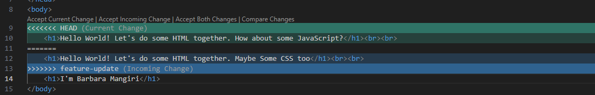

# This Read Me Contains details of the steps I took to complete the assignment"

1. Cloning a Repository:
    - I chose the repository for a html and css project at https://github.com/jonasschmedtmann/html-css-course
    - I cloned this repository to my local machine on git bash terminal by using the command: git clone https://github.com/jonasschmedtmann/html-css-course
    - I explored the repository's structure, files, and history.

2. Forking a Repository:
    - I also forked the repoitory to my GitHub account 
    - Then I cloned the forked repository to my local machine on git bash terminal by using the command: git clone https://github.com/barbzyqueen/html-css-course.git
    

3. Creating and Switching Branches:
    - In the git bash terminal, I created a new branch and switched to it by using the command: git checkout -b feature-update

4. Making Changes and Committing:

    - In the feature-update branch, I created a index.html file
    - Then I added the changes to the staging area using the command: git add .
    - I commited the changes using the command git add -m "Added Changes to index.html file in feature-update branch"

5. Merging Changes:
    - I switched back to the master branch using the command: git checkout -
    - I merged the changes from the `feature-update` branch into the master branch using the command: git merge feature-update
    - The index.html file was added to the master branch

6. Creating Conflicts:
In my forked repository on my local machine I also created an index.html file
    - I created an index.html file
    - Then I added the changes to the staging area using the command: git add .
    - I commited the changes using the command git add -m "Added  index.html file in master branch"
    - In the git bash terminal, I created a new branch and switched to it by using the command: git checkout -b feature-update
    - In my the feature-update branch I modified a line of code. I changed the contents of the h2 tag in line 9
    - I added and committed the changes 
    - I switched back to the master branch using the command: git checkout -
    - I modified the code on line 9 again in the index.html file of the master branch

7. Resolving Conflicts:
    - I added and committed the changes using the command git: merge feature-update
    - This created a conflict and gave me the following error:
        Auto-merging index.html
        CONFLICT (content): Merge conflict in index.html
        Automatic merge failed; fix conflicts and then commit the result.
    - In the index.html file, I had to aceept either the current change or incoming change to resolve the conflict
        
    - I chose the incoming change and the conflict was resolved.

8. Enabling GitHub Pages:
    - I already had my index.html file created in my forked repository
    - To deploying my index.html file live using github pages
    - I navigated to the forked repository on my github account
    - I opened  Settings Tab  tab near the top of the repository page.
    - I clicked on Pages, in the left sidebar under "Code and automation"
    - Afterwards, I configured my GitHub Pages
    - Under the "Build and deployment" section, I clicked the "Source" dropdown and selected Deploy from Branch
    - I saved my settings and waited for Deployment.

9.  Accessing the Published Page:
    - Afterwards I was able to access my html file live with the following  url: https://barbzyqueen.github.io/html-css-course/

    Navigate to Your Repository: Go to the GitHub website and navigate to the repository you want to set up GitHub Pages for.
Open the Settings Tab: Click on the Settings tab near the top of the repository page.
Go to the Pages Section:
In the left sidebar under "Code and automation," you will find a section called Pages.
Click on Pages.
Configure GitHub Pages:
In the "Build and deployment" section, you will see the "Source" dropdown.
Choose the branch you want to use for GitHub Pages from the dropdown menu (commonly main or master, or a specific branch like gh-pages).

If necessary, select a folder from the branch, such as /root or /docs.
Save Your Settings:
After making your selections, click the Save button.
Wait for Deployment:
GitHub will automatically start building and deploying your site.
This process can take a few minutes.
Access Your Site:
Once the deployment is complete, you’ll see a confirmation message with the URL where your site is published (e.g., https://your-username.github.io/your-repository).

    
10. Exploring Open Source Projects:

    - I searched and found the first-contributions open-source project: https://github.com/firstcontributions/first-contributions

    - I explored the documentation, issues, and contribution guidelines.